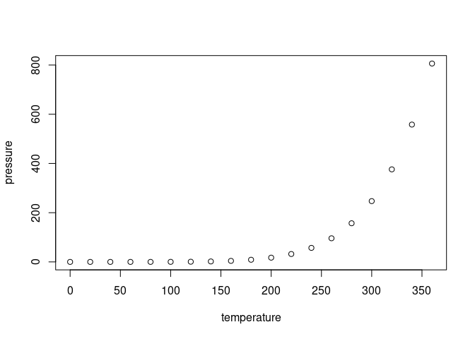

<!-- README.md is generated from README.Rmd. Please edit that file -->

# PLEIOVAR

<!-- badges: start -->
<!-- badges: end -->

The goal of PLEIOVAR is to …

## Installation

<<<<<<< HEAD
You can install the development version of PLEIOVAR from
[GitHub](https://github.com/) with:

``` r
# install.packages("devtools")
devtools::install_github("LEPSNES/PLEIOVAR")
=======
You can install the development version of PLEIOVAR like so:

``` r
# FILL THIS IN! HOW CAN PEOPLE INSTALL YOUR DEV PACKAGE?
>>>>>>> 83dc8a2d0f83dc4ce6b54f2f0acacee04122d5de
```

## Example

This is a basic example which shows you how to solve a common problem:

<<<<<<< HEAD
### PC-SNP

This is one step of PLEIOVAR pipeline to generate genewise principle
components.

``` r
library(PLEIOVAR)
infolder <- system.file("extdata", "pc_snp", package = "PLEIOVAR")
outfolder <- "dev/func_output"
OPF_snp <-  0.75
freq_cut <-  0.005
block_name <-  "blocktest"
pc_snp(infolder, outfolder, OPF_snp, freq_cut, block_name)
#> [1] "/tmp/RtmpsBlE2z/temp_libpathbe3a56f79409b/PLEIOVAR/extdata/pc_snp/Assemble/gene1_assembled"
#> [1] "/tmp/RtmpsBlE2z/temp_libpathbe3a56f79409b/PLEIOVAR/extdata/pc_snp/Assemble/gene2_assembled"
#> [1] "/tmp/RtmpsBlE2z/temp_libpathbe3a56f79409b/PLEIOVAR/extdata/pc_snp/Assemble/gene3_assembled"
#> [1] "/tmp/RtmpsBlE2z/temp_libpathbe3a56f79409b/PLEIOVAR/extdata/pc_snp/Assemble/gene4_assembled"
#> [1] "/tmp/RtmpsBlE2z/temp_libpathbe3a56f79409b/PLEIOVAR/extdata/pc_snp/Assemble/gene5_assembled"
#> [1] "/tmp/RtmpsBlE2z/temp_libpathbe3a56f79409b/PLEIOVAR/extdata/pc_snp/Assemble/gene6_assembled"
#> [1] "/tmp/RtmpsBlE2z/temp_libpathbe3a56f79409b/PLEIOVAR/extdata/pc_snp/Assemble/gene7_assembled"
#> [1] "/tmp/RtmpsBlE2z/temp_libpathbe3a56f79409b/PLEIOVAR/extdata/pc_snp/Assemble/gene8_assembled"
#> [1] "/tmp/RtmpsBlE2z/temp_libpathbe3a56f79409b/PLEIOVAR/extdata/pc_snp/Assemble/gene9_assembled"
#> [1] "/tmp/RtmpsBlE2z/temp_libpathbe3a56f79409b/PLEIOVAR/extdata/pc_snp/Assemble/gene10_assembled"
#> [1] "/tmp/RtmpsBlE2z/temp_libpathbe3a56f79409b/PLEIOVAR/extdata/pc_snp/Assemble/gene11_assembled"
#> [1] "/tmp/RtmpsBlE2z/temp_libpathbe3a56f79409b/PLEIOVAR/extdata/pc_snp/Assemble/gene12_assembled"
#> [1] "/tmp/RtmpsBlE2z/temp_libpathbe3a56f79409b/PLEIOVAR/extdata/pc_snp/Assemble/gene13_assembled"
#> [1] "/tmp/RtmpsBlE2z/temp_libpathbe3a56f79409b/PLEIOVAR/extdata/pc_snp/Assemble/gene14_assembled"
#> [1] "/tmp/RtmpsBlE2z/temp_libpathbe3a56f79409b/PLEIOVAR/extdata/pc_snp/Assemble/gene15_assembled"
#> [1] "/tmp/RtmpsBlE2z/temp_libpathbe3a56f79409b/PLEIOVAR/extdata/pc_snp/Assemble/gene16_assembled"
#> [1] "/tmp/RtmpsBlE2z/temp_libpathbe3a56f79409b/PLEIOVAR/extdata/pc_snp/Assemble/gene17_assembled"
#> [1] "/tmp/RtmpsBlE2z/temp_libpathbe3a56f79409b/PLEIOVAR/extdata/pc_snp/Assemble/gene18_assembled"
#> [1] "/tmp/RtmpsBlE2z/temp_libpathbe3a56f79409b/PLEIOVAR/extdata/pc_snp/Assemble/gene19_assembled"
#> [1] "/tmp/RtmpsBlE2z/temp_libpathbe3a56f79409b/PLEIOVAR/extdata/pc_snp/Assemble/gene20_assembled"
```

To get help

``` r
?pc_snp
```
=======
``` r
library(PLEIOVAR)
## basic example code
```

What is special about using `README.Rmd` instead of just `README.md`?
You can include R chunks like so:

``` r
summary(cars)
#>      speed           dist       
#>  Min.   : 4.0   Min.   :  2.00  
#>  1st Qu.:12.0   1st Qu.: 26.00  
#>  Median :15.0   Median : 36.00  
#>  Mean   :15.4   Mean   : 42.98  
#>  3rd Qu.:19.0   3rd Qu.: 56.00  
#>  Max.   :25.0   Max.   :120.00
```

You’ll still need to render `README.Rmd` regularly, to keep `README.md`
up-to-date. `devtools::build_readme()` is handy for this. You could also
use GitHub Actions to re-render `README.Rmd` every time you push. An
example workflow can be found here:
<https://github.com/r-lib/actions/tree/v1/examples>.

You can also embed plots, for example:



In that case, don’t forget to commit and push the resulting figure
files, so they display on GitHub and CRAN.
>>>>>>> 83dc8a2d0f83dc4ce6b54f2f0acacee04122d5de
